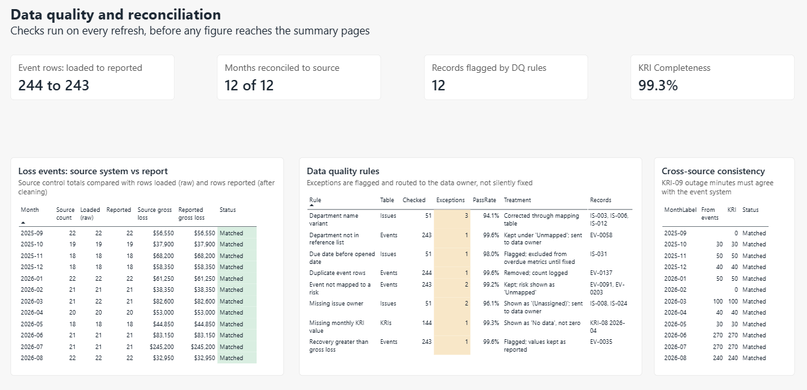
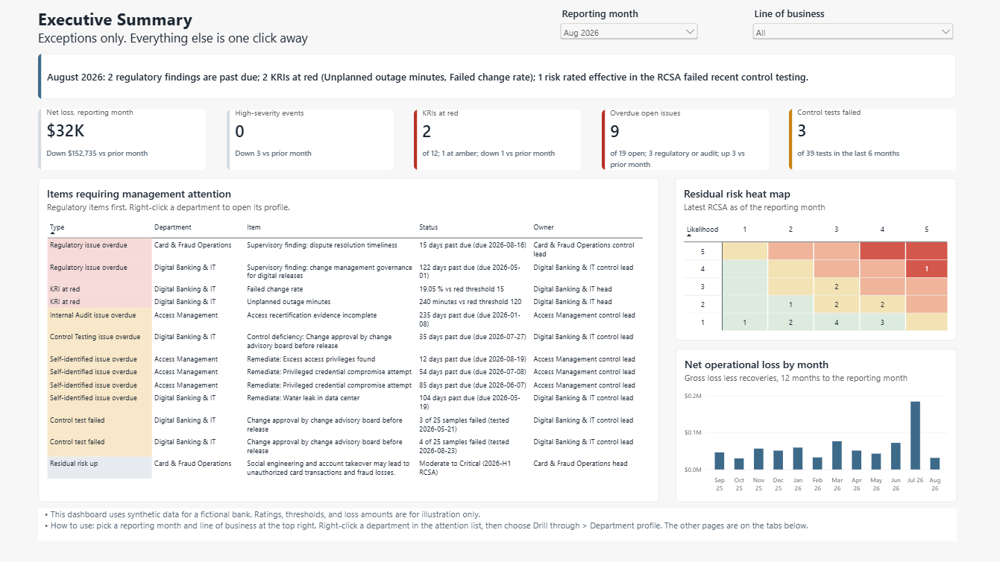
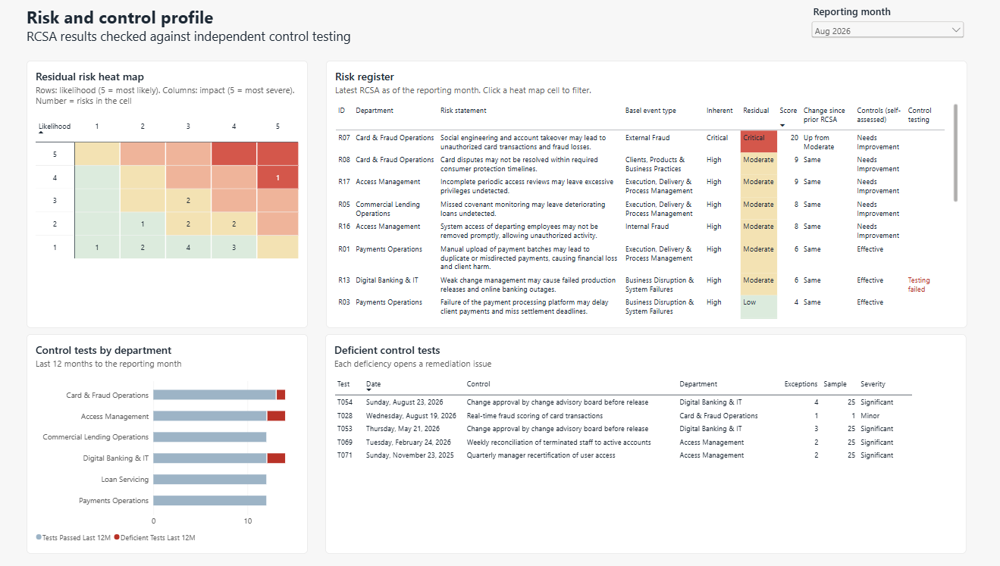
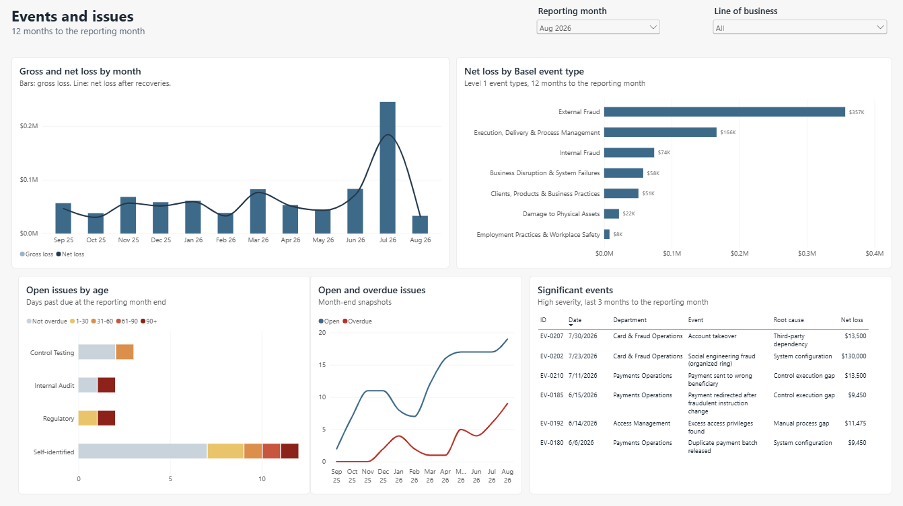
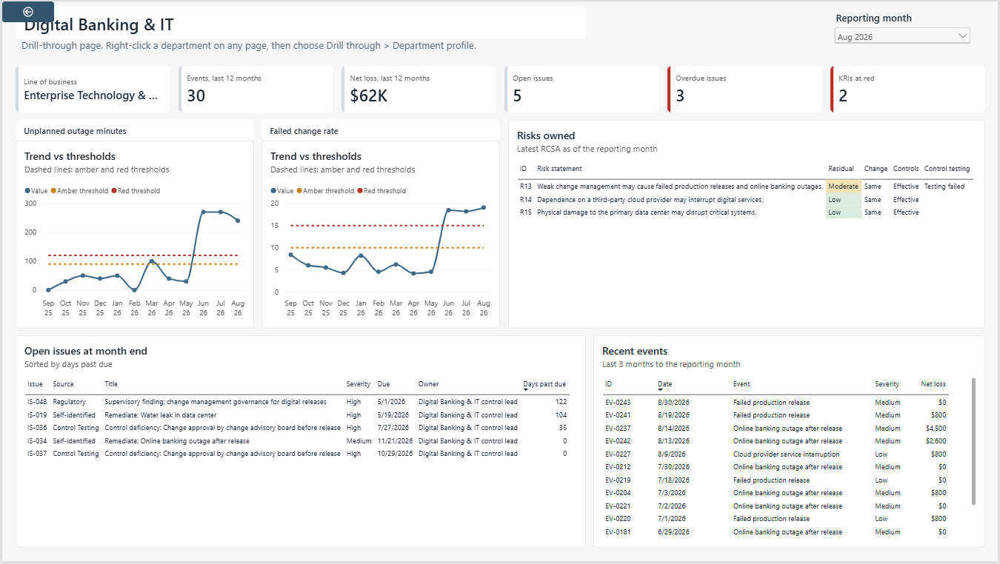

# operational-risk-powerbi

Executive risk dashboard for the Risk & Controls program of a fictional bank, built on synthetic data. It brings loss events, issues, KRIs, RCSA results, and control testing into one model and shows management what needs attention each month.

**Data:** synthetic, September 2025 to August 2026, in six files that stand in for separate systems: loss events (243 after removing one duplicate), remediation issues (51, raised through self-identification, control testing, internal audit, and regulators), a GRC export (18 risks, two RCSA cycles, 36 controls, 78 control tests), monthly KRIs (12 indicators with amber and red thresholds), reference tables, and the source system's control totals. Event types follow the seven Basel Level 1 categories. A few data quality problems were planted on purpose to test the checks.

## Workflow

1. **Consolidation** — read all six sources through two reusable Power Query functions, with the folder path held in a parameter. Department names that differ across systems are mapped through a reference table, not hard-coded
2. **Data quality** — eight rules run on every refresh: duplicates, unmapped departments, events without a risk, recovery above loss, missing owners, due dates before opened dates, name variants, and missing KRI values. Flagged records are listed for the data owner instead of being fixed quietly; unknown departments stay under "Unmapped" so totals still reconcile
3. **Reconciliation** — check event counts and gross loss against the source control totals month by month. The planted duplicate shows up as a one-row break in March 2026 and clears after cleaning. KRIs built from event data are checked against the events themselves 
4. **Month-end snapshots** — expand each issue into one row for every month end it was open, so open and overdue counts can be reported for any month
5. **Data model** — star schema: six fact tables share the department and line of business, risk, Basel event type, and date dimensions. Relationships filter in one direction only; issues use role-playing dates for opened, due, and closed
6. **Measures** — one reporting-month selector drives every page. Month-end counts are read at the selected month only, since they cannot be summed across months; RCSA results come from the latest assessment on or before that month; KRI status is calculated against thresholds stored as data, so a threshold change needs no change to the report

The Power BI report has four pages for management and one for the reporting team: an executive summary (summary line that updates with the month, KPI cards against the prior month, and an attention list with regulatory findings first), a risk and control profile (residual risk heat map that filters the risk register, with self-assessed control ratings beside independent test results), events and issues (loss trend, loss by Basel event type, issue aging), a department drill-through page, and the data quality page.
   

## Findings

As of August 2026, in the synthetic data:

- **Digital Banking & IT** — change management controls were rated effective in the RCSA, yet the change approval control failed testing in May and again in August. Outage minutes and failed change rate stayed red from June to August, and a supervisory finding on change management was 122 days past due. Each signal looks routine alone; side by side, they point to a weakness the self-assessment missed
- **Card fraud** — the residual rating rose from Moderate to Critical in the 2026-H1 RCSA. In July, a single social engineering event ($185,000 gross, $55,000 recovered) took monthly net loss to $184,312
- **Access Management** — an internal audit finding on access recertification was 235 days past due, and the leaver-access KRI sat at amber in most months

## Repository contents

- `data/` — the six source files
- `powerbi/` — the Power BI report
- `images/` — dashboard screenshots

## Notes and limits

- All data is synthetic; rating scales, thresholds, and the residual-risk rule are illustrative, not any bank's methodology
- Basel Level 1 is the shared taxonomy; a bank's own risk taxonomy would map to it
- Cleaning sits in Power Query because the sources are files; in production, stable logic would move upstream into SQL views
- Row-level security and scheduled refresh need the Power BI service and are not included
- To open the report, point the `SourceFolder` parameter (Transform data → Manage parameters) to the local `data/` folder

**Tools:** Power BI Desktop (Power Query, DAX), Excel

